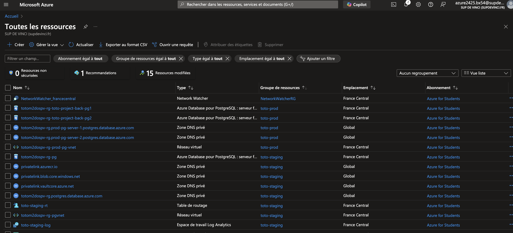

# Infrastructure Azure avec Terraform

## Auteur
**Thomas VIAUD**

---

## Description du projet

Ce projet Terraform permet de déployer une infrastructure complète sur Microsoft Azure en utilisant des modules réutilisables pour garantir **modularité**, **maintenabilité** et **cohérence**. 

L'architecture est conçue pour gérer les environnements suivants :

- **Backend** : Comprend le réseau, la base de données PostgreSQL, et un compte de stockage.
- **Frontend** : Inclut un Azure Container Registry (ACR), une zone DNS privée, et un réseau pour les ressources frontales.

Chaque composant est isolé en modules pour permettre une gestion claire et simplifiée.

---

## Fonctionnalités principales

### Backend
- Création d'un **réseau virtuel (VNet)** et de sous-réseaux.
- Déploiement d'un **serveur PostgreSQL flexible** avec haute disponibilité.
- Provisionnement d'un **compte de stockage Azure** pour les besoins backend.
- Configuration de **sauvegardes automatiques** et de la **haute disponibilité** pour PostgreSQL.

### Frontend
- Déploiement d'un **Azure Container Registry (ACR)** pour les images de conteneurs.
- Création d'une **zone DNS privée** avec des enregistrements A personnalisables.
- Intégration des **réseaux frontend et backend** via des liens réseau privés.
- Support des environnements **staging**, **prod**, **preprod**, et **recette** pour garantir la flexibilité et la séparation des déploiements.

Screenschots Des 2 groupes de ressources 
- Staging   m2dospv-rg
- Prod      toto-prod

