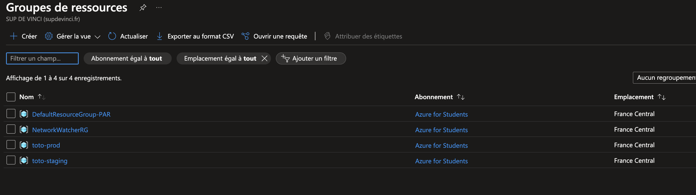

# Infrastructure Azure avec Terraform

## Auteur
**Thomas VIAUD**

---

## Description du projet

Ce projet Terraform permet de déployer une infrastructure ciblée sur Microsoft Azure en mettant l’accent sur la gestion et la configuration optimisée de serveurs PostgreSQL. L’utilisation de modules réutilisables garantit modularité, maintenabilité et cohérence.

L’architecture est conçue pour répondre aux besoins des environnements de production et de staging, en offrant une solution robuste et flexible pour la gestion des bases de données.

Screenschots Des 2 groupes de ressources 
- Staging   m2dospv-rg
- Prod      toto-prod

